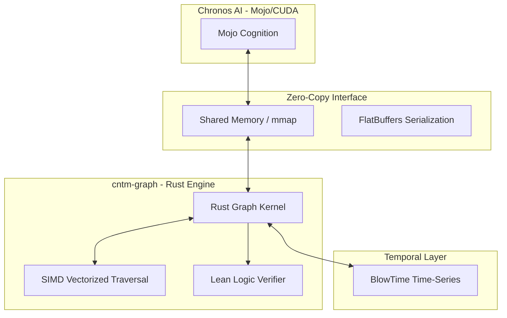

# System Architecture

## 🏗️ High-Level Overview
The Continuum Graph Engine (cntm-graph) is a specialized memory architecture that fuses symbolic logic with neural performance. It provides a zero-latency bridge between persistent knowledge graphs and real-time AI inference engines.

## 🗺️ Component Diagram

## 🛠️ Technology Stack
- **Programming Languages:** Rust, Mojo, C++ (FFI)
- **Tooling & Infrastructure:** 
  - **Memory:** Shared Memory (SHM), `mmap`
  - **Serialization:** FlatBuffers (Zero-copy)
  - **Acceleration:** SIMD (AVX-512/NEON)
  - **Verification:** Lean Proof Assistant
  - **Storage:** BlowTime (Time-series integration)
- **Core Pattern:** Zero-Cost Logic & Data Locality
- **Strategy:** The Cognitive Memory Standard for AGI

## 🔗 Internal References
- Engineering rules: [PRINCIPLES.md](PRINCIPLES.md)
- Live project map: [STRUCTURE.tree](STRUCTURE.tree)
