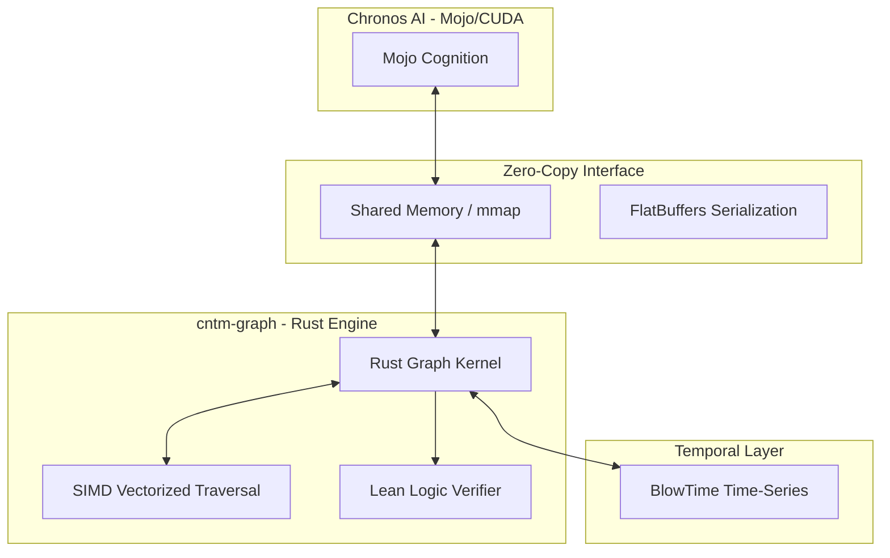

# System Architecture

## 🏗️ High-Level Overview
The Continuum Graph Engine (cntm-graph) is a specialized memory architecture that fuses symbolic logic with neural performance. It provides a zero-latency bridge between persistent knowledge graphs and real-time AI inference engines.

## 🗺️ Component Diagram

## 🧠 Core Architectural Patterns

### 1. Data-Oriented Design (DOD) & SoA
The kernel utilizes **Structure of Arrays (SoA)** instead of the traditional Array of Structures (AoS). By storing node and edge attributes in contiguous memory buffers, we maximize CPU cache locality and minimize cache misses during high-speed traversal.

### 2. Zero-Copy Memory Bridge
A unified memory layout is established via **Memory-Mapped (mmap) Shared Memory**. Both Rust (Producer) and Mojo (Consumer) map the same physical memory region into their address space, allowing Mojo to read graph data directly from raw pointers without any serialization or copying overhead.

### 3. SIMD Alignment (AVX-512)
All core data buffers are explicitly aligned to **64-byte boundaries**. This ensures that vectorized operations (AVX-512) can process 16 nodes or edges per instruction at peak hardware efficiency.

### 4. Hybrid Performance Layout
- **Hot Path (Core Kernel):** Fixed-size fields (`ID`, `Type`, `Weight`, `State`) optimized for sub-nanosecond traversal.
- **Cold Path (Metadata):** Flexible, variable-sized metadata handled via **FlatBuffers** tables, ensuring extensibility without penalizing traversal speed.

## 🛠️ Technology Stack
- **Programming Languages:** Rust (Core Kernel), Mojo (Cognition/FFI), C++ (FFI Bridge)
- **Tooling & Infrastructure:** 
  - **Memory:** Shared Memory (SHM), `memmap2`, `mmap`
  - **Serialization:** FlatBuffers (Zero-copy metadata)
  - **Acceleration:** SIMD (AVX-512/NEON)
  - **Verification:** Lean Proof Assistant (Formal mutation verification)
  - **Storage:** BlowTime (Temporal time-series integration)

## 🔗 Internal References
- Engineering rules: [PRINCIPLES.md](PRINCIPLES.md)
- Design Decisions: [DESIGN_DECISIONS.md](DESIGN_DECISIONS.md)
- Live project map: [STRUCTURE.tree](STRUCTURE.tree)
- Detailed Specs: `docs/superpowers/specs/`
